# P3 Concurrent programming with coroutines and flows

## 14 Coroutines

### 14.1 Concurrency vs. parallelism

Concurrency: not physically executing multiple task simultaneously on multiple CPU cores.

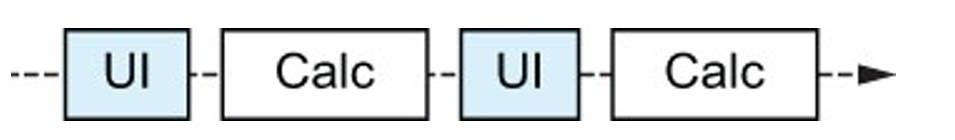

Parallelism: physically executing multiple tasks simultaneously on multiple CPU cores. 

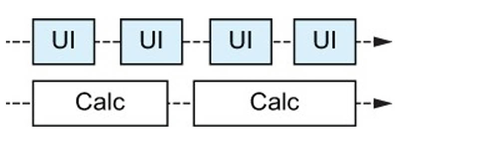


### 14.2 Concurrency the Kotlin way: Suspending functions and coroutines

协程比线程更轻量级

使用协程的基本抽象：suspending functions

协程与其他并发模型（callbacks、futures、reactive streams）的区别


### 14.3 Comparing threads and coroutines

现代操作系统每次只能高效管理数千个线程。每个系统线程需要分配几兆字节的内寸，线程切换操作执行在系统内核，这些开销会快速累积。

线程等待操作（网络请求）完成，会 blocked，该线程在等待响应期间不能做其他工作，只会 sleep，却占用系统资源。意味着创建新线程时要非常小心，且不鼓励以细粒度或短期方式使用它们。

线程默认情况下作为独立进程存在，这在管理和协调线程工作时会带来挑战，尤其是在取消和异常处理等概念方面。这些制约因素限制了线程的适用性：创建新线程的时间受到限制（因为创建线程的成本很高，而且等待结果可能会阻塞线程），管理线程的方式也受到限制（因为线程默认情况下没有 "层次结构 "的概念）。

协程是线程的另一种抽象，可用于任何使用线程的地方，但具有以下优点：

- 协程是非常轻量级的抽象。一台机器可运行100,000 个协程。创建和管理开销小，可以更精细地使用协程（短期任务）。
- 协程可以在不阻塞系统资源的情况下暂停执行，并在稍后恢复执行。与阻塞线程相比，它能高效执行异步任务，如等待网络请求或 IO 任务。
- 通过一种结构化并发的概念，协程为并发任务建立了结构和层次，并提供了取消和错误处理机制。当并发计算的一部分失败或不再需要时，结构化并发会确保作为该计算的子程序启动的其他协程被取消。

协程是通过在一个或多个 JVM 线程上运行来实现的。使用 coroutines 的代码仍然可以利用底层线程模型提供的并行性，但不会受到操作系统对线程的限制。

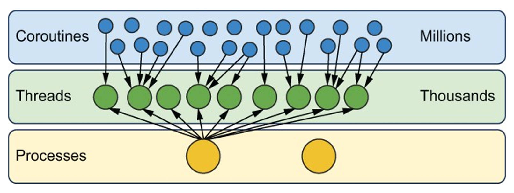

协程被设计为一种独立于底层执行模型的并发抽象。事实上，它们的设计与 JVM 解耦，允许在其他平台上（iOS）运行 Kotlin 代码时使用协程。

Java 传统线程 API 是针对线程昂贵且很少创建的情况下而设计的。但在高度并发的代码中，协程会一直启动。协程 API就是针对此类代码设计的，效率和内存消耗都进行了优化。

结构化并发是协程 API 设计核心原则的基础。在大量使用并发的代码中，会出现 “启动并发操作时忘记等待或取消，造成潜在的资源泄漏”。Kotlin 正则表达式 API 从一开始就旨在确保这些错误难以发生。要泄露一个 coroutine，你必须多走一英里，编写额外的代码。使用 Kotlin 例程编写的最短代码总是正确的。

学习协程教会你在设计并发代码架构时，要明确区分本地和远程（suspending）操作，并保持结构化并发的实践。


### 14.4 Functions that can pause: Suspending functions

与其他并发方法不同，使用协程的一个关键特性是，很多情况下，不需要对代码做太多改变，它看起来仍然是顺序的。

```kotlin
suspend fun login(credentials: Credentials): UserID
suspend fun loadUserData(userID: UserID): UserData
fun showData(data: UserData)

suspend fun show UserInfo(credentials: Credentials) {
    val useID = login(credentials)
    val userData = loadUserData(useID)
    showData(userData)
}
```

suspend 表明该函数可以暂停执行。suspend 不会 block 依赖的线程，相反，当函数暂停执行时，其他代码可以在同一线程上运行。

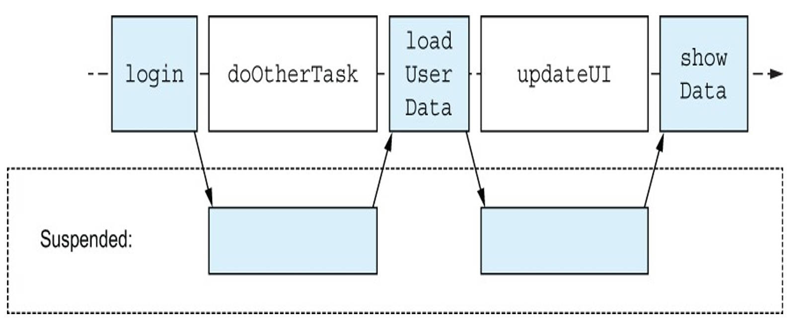

代码的顺序结构没有改变。暂停过程中，底层线程可以继续进行其他工作：绘制UI、处理用户请求、显示其他数据等。从 UI 线程调用该函数不会导致 UI 冻结。


### 14.5 Comparing coroutines to other approaches

**callback 实现**

```kotlin
fun loginAsync(credentials: Credentials, callback: (UserID) -> Unit)
fun loadUserDataAsync(userID: UserID, callback: (UserData) -> Unit)
fun showData(data: UserData)
fun showUserInfo(credentials: Credentials) {
    loginAsync(credentials) { userID ->
        loadUserDataAsync(userID) { userData ->
            showData(userData)
        }
    }
}
```

showUserInfo 函数需要重写，使用单独的回调。在生成的代码中，你会发现一个回调又一个回调。虽然这对于两个函数调用来说还可以应付，但随着逻辑的发展，会陷入嵌套回调的混乱之中，难以阅读。

出现了其他对抗回调地狱的方法；不过，这些方法通常仍有复杂性。例如，使用 CompletableFuture 可以避免嵌套回调，但需要学习 thenCompose 和 thenAccept 等新操作符的语义。这还需要更改 loginAsync 和 loadUserDataAsync 函数的返回类型--它们的返回类型现在被封装在 CompletableFuture 中。

```kotlin
fun loginAsync(credentials: Credentials): CompletableFuture<UserID>
fun loadUserDataAsync(userID: UserID): CompletableFuture<UserData>
fun showData(data: UserData)
fun showUserInfo(credentials: Credentials) {
    loginAsync(credentials)
        .thenCompose { loadUserDataAsync(it) }
        .thenAccept { showData(it) }
 }
```

同样，通过 reactive streams（如使用 RxJava）实现可以避免 callback hell，但仍需要更改函数的签名--它们现在返回的是 Single 封装的值--并使用 flatMap、doOnSuccess 和 subscribe 等操作符。

```kotlin
fun login(credentials: Credentials): Single<UserID>
fun loadUserData(userID: UserID): Single<UserData>
fun showData(data: UserData)

fun showUserInfo(credentials: Credentials) {
    login(credentials)
    	.flatMap { loadUserData(it) }
    	.doOnSuccess { showData(it) }
    	.subscribe()
}
```


14.5.1 Calling a suspending function

suspend 函数需要在一个也可以暂停执行的代码块中被调用。

如何调用第一个 suspend 函数呢？main 函数也可以使用 suspend 修饰符，但是在一个很大的代码库或 Andorid SDK、framework 中编写代码时，不能简单修改 main 签名。更通用的方法是使用负责构建新协程的协程构建函数（coroutine builder functions），它们是调用 suspend 函数的典型入口。


### 14.6 Entering the world of coroutines: Coroutine builders

suspend 函数只能在另一个 suspend 函数或协程中调用。

一个协程是一个可挂起计算（suspendable computation）的实例，可将其视为可以与其他协程并发（并行）执行的代码块。协程包含暂停执行其体内函数所需的机制。创建协程，可以使用协程构建器函数（coroutine builder functions）：

- **runBlocking：**桥接阻塞代码和挂起函数
- **launch：**用于启动不返回任何值的新协程
- **async：**用于以异步方式计算值

现在讨论的多数函数不是标准库的一部分，而是 JetBrains 开发的 kotlinx.coroutines 的一部分。这使得并发相关功能可以独立于语言发布周期而发展。


14.6.1 From regular code into the realm of coroutines: The runBlocking function

使用 runBlocking 协程构建器函数把阻塞代码和挂起函数桥接起来，它创建并运行一个新的协程，并阻塞当前线程，直到协程完成。

```kotlin
suspend fun doSomethingSlowly() {
    delay(500.milliseconds)
    println("I'm done")
}

fun main() = runBlocking {
    doSomethingSlowly()
}
```

但是，使用协程的目的不就是为了避免阻塞线程吗？为什么要使用 runBlocking 呢？

使用 runBlocking 时，会阻塞一个线程。但是，在此协程中，可以启动任意数量的附加子协程，这不会阻塞任何其他线程。相反，它们会同时运行，每当暂停时释放一个线程以供其他协程运行其代码。

要启动此类附加子协程，可使用 launch 协程构建器。


14.6.2 Creating start-and-forget coroutines: The launch function

launch 用于启动一个新的子协程。适用场景：运行一段代码，但不等待它计算返回值。

```kotlin
private var zeroTime = System.currentTimeMills()
fun log(message: Any?) = 
	println("${System.currentTimeMills() - zeroTime}" + 
            "[${Thread.currentThread().name}] $message")

fun main() = runBlocking{
    log("The first, parent, coroutine starts")
    launch {
        log("The second coroutine starts and is ready to be suspended")
        delay(100.milliseconds)
        log("The second coroutine is resumed")
    }
    launch {
        log("The third coroutine can run in the meantime")
    }
    log("The first coroutine has launched two more coroutines")
}
```

使用 -Dkotlinx.coroutines.debug JVM option 运行，可获得协程名称信息

```kotlin
36 [main @coroutine#1] The first, parent, coroutine starts
40 [main @coroutine#1] The first coroutine has launched tw
o more coroutines
42 [main @coroutine#2] The second coroutine starts and is
ready to be suspended
47 [main @coroutine#3] The third coroutine can run in the
meantime
149 [main @coroutine#2] The second coroutine is resumed
```

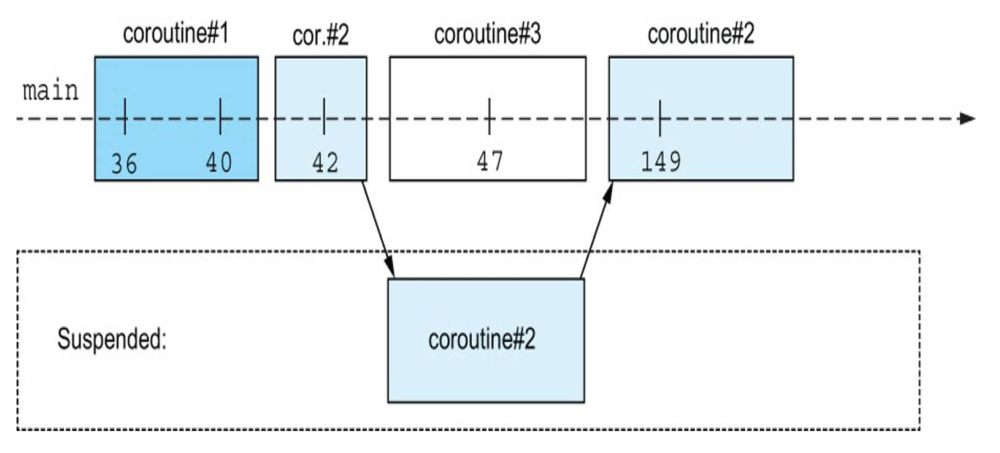

挂起的协程去哪了？编译器生成负责挂起、恢复和调度协程的支持代码。挂起函数的代码在编译时进行转换，以便当协程挂起时，状态信息存储在内存中。根据此信息，在稍后恢复并执行。

launch，不能从协程内的代码返回值。launch 函数返回一个 Job 类型的对象，可以将其视为启动协程的句柄。可以使用 Job 对象来控制协程的执行。


14.6.3 Awaitable computations: The async builder

如果希望执行异步计算，返回计算结果，可以使用 async 构建器函数。async 函数返回 Deferred<T> 的实例，通过挂起的 await 函数等待结果。

```kotlin
suspend fun slowlyAddNumbers(a: Int, b: Int): Int {
    log("Waiting a bit before calculating $a + $b")
    delay(100.milliseconds * a)
    return a + b
}

fun main() = runBlocking {
    log("Starting the async computation")
    val myFirstDeffered = async { slowlyAddNumbers(2,2) }
    val mySecondDeffered = async { SlowlyAddNumbers(4,4) }
    
    log("Waiting for the deferred value to be available")
    log("The first result: ${myFirstDeferred.await()}")
    log("The second result: ${mySecondDeferred.await()}")
}
```

```kotlin
 0 [main @coroutine#1] Starting the async computation
 4 [main @coroutine#1] Waiting for the deferred value to be
 available
 8 [main @coroutine#2] Waiting a bit before calculating 2 +
 2
 9 [main @coroutine#3] Waiting a bit before calculating 4 +
 4
 213 [main @coroutine#1] The first result: 4
 415 [main @coroutine#1] The second result: 8
```

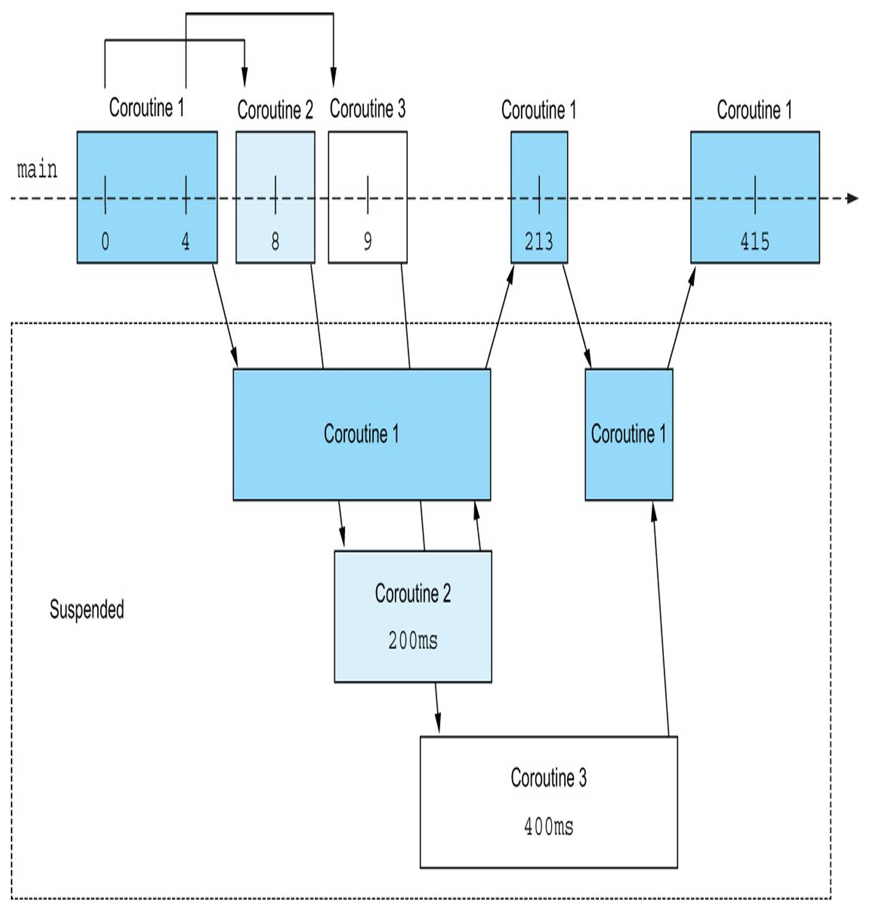

不同名称下的 Deferred 类型，例如 Future 或 Promise。它们的概念都是相同的：延迟对象表示可能尚不可用的值。这个值需要计算或检索。

仅当你想要并发执行独立任务并等待其结果时才使用 async。

async{} 构建器函数和挂起的 await 函数不是 kt 中的关键字。suspend 函数是非常强大的低级抽象，async/await 这样的功能只能在独立库中实现。

协程是线程上的抽象，但是代码实际运行在哪些线程上？runBlocking 代码仅在调用该函数的线程上运行。


### 14.7 Deciding where your code should run: Dispatchers

协程的调度程序（dispatcher）确定协程使用哪些线程来执行。通过选择一个 dispatcher，可以将协程的执行限制到特定线程或将其调度到线程池。协程不绑定到任何特定线程，协程可以按照 dispatcher 的指示在一个线程中暂停执行并在另一个线程中恢复其执行。


14.7.1 Choosing a dispatcher

默认情况下，协程从其父级继承 dispatcher。

- **多线程通用 dispatcher：Dispatchers.Default**

  由一个线程池提供支持，线程数为 CPU 可用核心数。协程可以在多核计算机上并行运行。启动大多数协程时使用默认 Dispatcher。每个协程只是挂起而不是阻塞它使用的线程，即使单个线程也可以处理上万个协程。

- **UI Thread：Dispatchers.Main**

  有时需要将一些操作限制到特定线程（UI thread or main thread）。例如重新绘制用户界面。要从协程安全执行这些操作，你可以在分派协程时使用 Dispatchers.Main。这并不意味着你必须在 main dispatcher 运行整个协程。

- **Blocking IO Tasks：Dispatchers.IO**

  使用三方库时，你并不总是可以使用协程构建的 API。对于这些情况，当你拥有的只是一个阻塞 API（例如，与数据库系统交互）时，你从 default dispatcher 调用此功能可能有问题。default dispatcher 的线程数等于可用 CPU 核心数，线程池可能被耗尽，其他协程不能运行。IO dispatcher 启动的协程将在自动扩展的线程池中执行，该线程池正是为这种非 CPU 密集型工作而分配的，你只需等待阻塞 API 返回即可。

| Dispatcher             | Number of threads                                            | Used for                                                     |
| ---------------------- | ------------------------------------------------------------ | ------------------------------------------------------------ |
| Dispatchers.Default    | Number of CPU cores                                          | General-purpose operations, CPU-bound operations             |
| Dispatchers.Main       | One                                                          | UI-bound logic (UI thread), only when in the context of a UI framework |
| Dispatchers.IO         | Up to 64 threads (auto-scaling) or number of CPU cores (whichever is larger) | Offloading blocking IO tasks                                 |
| Dispatchers.Unconfined | Whatever thread                                              | Advanced cases: where immediate scheduling is required (non-general-purpose) |
| limitedParallelism(n)  | Custom(n)                                                    | Custom scenarios                                             |

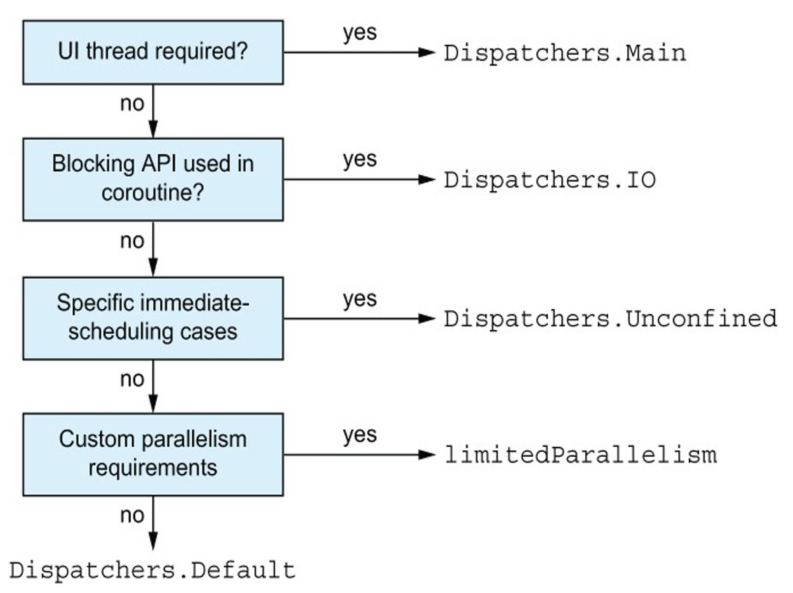


14.7.2 Passing a dispatcher to a coroutine builder

要使协程在特定 dispatcher 上运行，可以将 dispatcher 作为参数传递给 coroutine builder function。

```kotlin
fun main() {
    runBlocking {
        log("Doing some work")
        
        launch(Dispatchers.Default) {
            log("Doing some background work")
        }
    }
}
```

```kotlin
26 [main @coroutine#1] Doing some work
33 [DefaultDispatcher-worker-1 @coroutine#2] Doing some background work
```

可以更细粒度地确定要执行协程的特定部分，而不是切换整个协程的 dispatcher，使用 withContext。


14.7.3 Using withContext to switch the dispatcher within a coroutine

```kotlin
launch(Dispatchers.Default) {
    val result = performBackgroundOperation()
    
    withContext(Dispatchers.Main) {
        updateUI(result)
    }
}
```

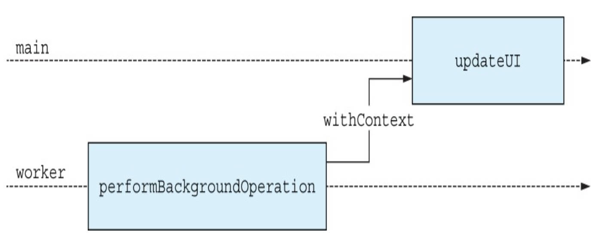


14.7.4 Coroutines and dispatchers aren‘t a magical fix for thread-safety concerns

单个协程始终按顺序执行，单个协程的任何部分都不会并行运行。与单个协程关联的数据不会遇到同步问题。多个（并行）协程读取和更改数据并不容易。

```kotlin
fun main() = runBlocking {
    val mutex = Mutex()
    var x = 0
    repeat(10_000) {
        launch(Dispatchers.Default) {
            mutex.withLock {
                x++
            }
        }
    }
    delay(1.seconds)
    println(x)
}
```

还可使用用于并发修改的原子和线程安全数据结构，例如 AtomicInteger 或 ConcurrentHashMap。当多个并发运行的协程修改相同数据时，需要执行同步或 lock，就像线程一样。


### 14.8 Coroutines carry additional information in their coroutine context

前面提供了不同的 dispatcher 作为 coroutine builder function 和 withContext funciton 的参数。该参数不是 CoroutineDispatcher，而是 CoroutineContext。

每个协程都以 CoroutineContext 的形式携带附加上下文信息。可将其视为一组各种元素。元素之一是 Dispatcher，决定协程在哪个或哪些线程上运行。还包含一个与协程关联的 Job 对象，负责其生命周期及其取消。CoroutineContext 还包含其他附加元数据，例如 CoroutineName 或 CoroutineExceptionHandler。

可以通过访问任何 suspend 函数内名为 coroutineContext 的特殊属性来检查当前协程上下文。当你将参数传递给协程构建器或 withContext 函数时，你将覆盖子协程上下文中的此特定元素。要一次覆盖多个参数，可以使用 + 运算符连接，该运算符是 CoroutineContext 对象重载的。

```kotlin
fun main() {
    runBlocking(Dispatchers.IO + CoroutineName("Coolroutine")) {
        introspect()
    }
}

// 27 [DefaultDispatcher-worker-1 @Coolroutine#1]
[CoroutineName(Coolroutine), CoroutineId(1),
"Coolroutine#1":BlockingCoroutine{Active}@d115c9f, Dispatchers.IO]
```

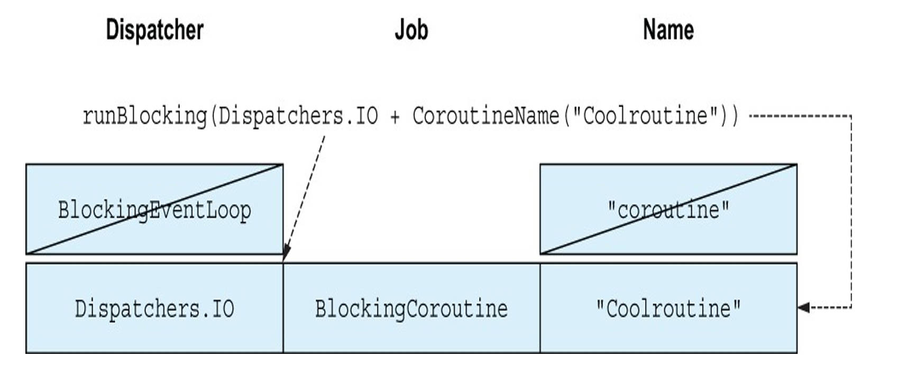


### summary

- 并发是指同时处理多个任务，表现为交织执行。并行是指同时物理执行，利用现代多核系统。

- 协程是一种在线程上工作的轻量级抽象，用于并发执行。

- Kotlin 中的核心并发原语是 suspend 函数，一个可以暂停执行的函数。挂起函数可以从另一个挂起函数或协程内调用。

- 与 reactive streams、callbacks、futures 等方法不同，suspend 函数不会改变代码的形状，看起来仍是顺序的。

- 协程是可挂起计算的实例。协程避免了阻塞线程引发的问题，阻塞线程浪费了昂贵、有限的系统资源。

- runBlocking、launch 和 async 等协程构建器允许创建新的协程。

- Dispatcher 决定协程运行在哪个线程或线程池。

- 不同的内置调度程序有不同的用途：Dispatchers.Default 是通用调度程序，Dispatchers.Main 在 UI 线程运行操作，Dispatcher.IO 用于调度阻塞 IO 任务。

- 大多数 dispatcher 都是多线程 dispatcher（例如 Dispatchers.Default 和 D.IO），意味着当多个协程并行修改相同数据时需要格外小心。

- 可以在创建协程时指定 dispatcher 或使用 withContext 在调度程序之间切换。

- 协程上下文包含与协程关联的附加信息。协程的 dispatcher 是协程上下方的一部分。

  


## 15 Structured concurrency

- 通过结构化并发的概念在协程之间建立层次结构
- 结构化并发如何为你提供对代码执行和取消的细粒度控制，自动在协程层次结构中传播取消
- 协程上下文和结构化并发之间的关系
- 编写在取消时行为正确的代码

如果不跟踪你的协程，会面临资源泄露和做不必要工作的风险。例如：用户请求网络资源并立即导航到不同的屏幕，如果你无法跟踪负责网络请求和对收到信息进行后处理的协程，你只能让它们运行完成，即使结果最后被丢弃。


### 15.1 Coroutines scopes establish structure between coroutines

对于结构化并发，每个协程都属于一个协程作用域 coroutine scope。协程作用于有助于建立协程间的父子关系。launch 和 async 协程构建器函数实际上是 CoroutineScope 接口的扩展函数。当你在另一个协程构建器的主体中使用 launch 或 async 创建新协程时，新协程会自动成为该协程的子级。

```kotlin
fun main() {
    runBlocking {
        launch {
            delay(1.seconds)
            launch {
                delay(250.milliseconds)
                log("Grandchild done")
            }
            log("Child 1 done")
        }
        launch {
            delay(500.milliseconds)
            log("Child 2 done")
        }
        log("Parent done")
    }
}
```

```kotlin
29 [main @coroutine#1] Parent done!
539 [main @coroutine#3] Child 2 done!
1039 [main @coroutine#2] Child 1 done!
1293 [main @coroutine#4] Grandchild done
```

结构化并发：协程之间存在父子关系（与协程关联的 Job 对象），意味着 runBlocking 调用知道有多少个它的孩子仍在工作，并继续等待，直到全部完成。

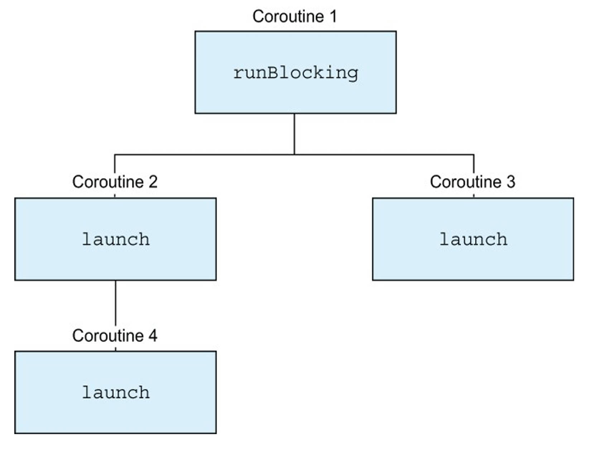

由于结构化并发，协程存在于层次结构中。每个协程都知道它的孩子和父母。

父协程被取消时自动取消子协程，可以帮助你在异常处理方面达到想要的行为。


15.1.1 Creating a coroutine scope: The coroutineScope function

每当使用协程构建器创建新的协程时，它们都会创建自己的 CoroutineScope。但你可以使用自己的协程作用域对协程进行分组，而无需创建全新的协程。可以使用 coroutineScope 函数，它是一个 suspend 函数，用于创建一个新的协程作用域，并在其自身完成之前等待其所有子协程完成。

coroutineScope 函数典例是工作的并发分解，利用多个协程一起执行计算。

```kotlin
suspend fun generateValue(): Int {
    delay(500)
    return Random.nextInt(0, 10)
}

suspend fun computeSum {
    log("Computing a sum...")
    val sum = coroutineScope {
        val a = async { generateValue() }
        val b = async { generateValue() }
        a.await() + b.await()
    }
    log("Sum is $sum")
}

fun main() = runBlocking {
    computeSum()
}

// 0 [main @coroutine#1] Computing a sum...
// 532 [main @coroutine#1] Sum is 10
```

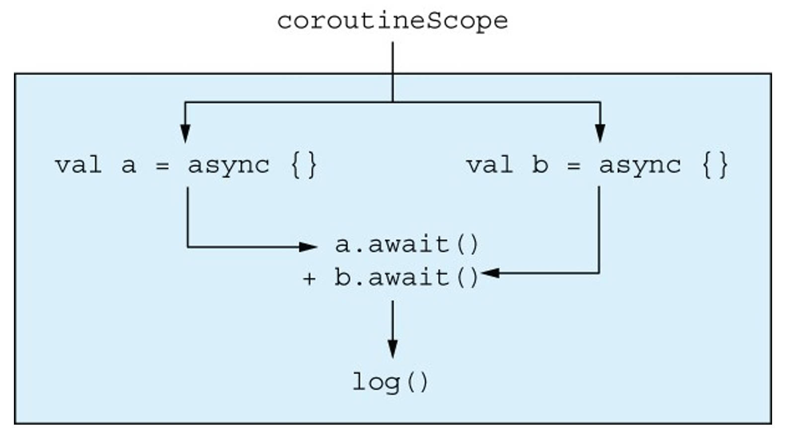


15.1.2 Associating coroutine scopes with components: CoroutineScope

需要构建一个定义自己的生命周期的类，管理并发进程和协程的启动和停止。可以使用 CoroutineScope 构造函数来创建新的独立协程作用域。此函数不会暂停执行，它知识为你提供一个新的协程作用于，你可以使用它来启动新的协程。

CoroutineScope 采用一个参数：与协程作用于关联的上下文。例如，可以在这里指定此范围内启动的协程所使用的 dispatcher。

默认情况下，调用 CoroutineScope 会自动创建一个新的 Job。大多数时候，使用 SupervisorJob（一种特殊的 Job，它可以防止未捕获的异常取消与同一作用域相关的其他例行程序并进一步传播异常）。 

创建一个类，该类可以启动和管理协程及其自身的生命周期。它采用协程 dispatcher 作为构造函数参数，并使用 CoroutineScope 函数创建与该类关联的新协程作用域。stop 函数取消与该类关联的作用域，以及之前启动的协程。

```kotlin
class ComponentWithScope(dispatcher: CoroutineDispatcher = Dispatchers.Default) {
    private val scope = CoroutineScope(dispatcher + SupervisorJob())
    
    fun start() {
        log("Starting")
        scope.launch {
            while(true) {
                delay(500)
                log("Component working")
            }
        }
        scope.launch {
            log("Doing a one-off task...")
            delay(500)
            log("Task done")
        }
    }
    
    fun stop() {
        log("Stopping")
        scope.cancel()
    }
}
```

可以构造此组件的新实例并调用 start 以使组件在内部启动其协程。然后，调用 stop，结束组件的生命周期。

```kotlin
fun main() {
    val c = ComponentWithScope()
    c.start()
    Thread.sleep(2000)
    c.stop()
}

 // 22 [main] Starting!
 // 37 [DefaultDispatcher-worker2 @coroutine#2] Doing a one-off task...
 // 544 [DefaultDispatcher-worker1 @coroutine#2] Task done!
 // 544 [DefaultDispatcher-worker2 @coroutine#1] Component working!
 // 1050 [DefaultDispatcher-worker1 @coroutine#1] Component working!
 // 1555 [DefaultDispatcher-worker1 @coroutine#1] Component working!
 // 2039 [main] Stopping!
```

coroutineScope 和 CoroutineScope 函数的不同用途：


15.1.3 The danger of GlobalScope


15.1.4 Coroutine contexts and structured concurrency

协程上下文与结构化并发的概念密切相关：它们沿着协程之间建立的相同父子层次结构继承。

启动一个新的协程时，协程上下文会发生什么？首先，子协程继承父 context，然后新的协程创建一个新的 Job 对象，该对象负责建立父子关系（该 Job 成为父协程 Job 的子级）。最后，应用协程上下方提供的参数，它们可能会覆盖之前继承的内容。


### 15.2 Cancellation

取消可以防止不必要的工作，有助于避免内存或资源泄漏。


15.2.1 Triggering cancellation

不同的协程构建器的返回值可以作为触发取消的句柄：launch 返回一个 Job，async 返回一个 Deferred，可以用来调用 cancel 来触发协程的取消

每个协程作用域的协程上下文还包含一个 Job，可以使用它以相同的方式取消作用域。


15.2.2 Invoking cancellation automatically after a time limit has been exceeded

withTimeout 和 withTimeoutOrNull 函数允许计算值，并限制计算花费的最大时间。


15.2.3 Cancellation cascades through all children


15.2.4 Cancelled coroutines throw CancellationExceptions in special places

取消的机制是通过在特殊位置抛出特殊的异常类型 CancellationException 来工作的。这些地方法首先是 suspension point。

取消的协程会在暂停点抛出 CancellationException。可以假设协程库内的所有挂起函数都引入了可以抛出 CancellationException 的点。可根据 scope 是否被取消，下面代码打印 “A" 或 “ABC”。

```kotlin
coroutineScope {
    log("A")
    delay(500) //the point where the function can be cancelled
    log("B")
    log("C")
}
```

由于协程使用异常在协程层次结构中传播取消，因此不要吞下此异常或自行处理它。

```kotlin
 suspend fun doWork() {
    delay(500.milliseconds)                             
    throw UnsupportedOperationException("Didn't work!")
 }
 fun main() {
    runBlocking {
        withTimeoutOrNull(2.seconds) {
            while (true) {
                try {
                    doWork()
                } catch (e: Exception) {                
                    println("Oops: ${e.message}")
                }
            }
        }
    }
 }
 // Oops: Didn't work!
 // Oops: Didn't work!
 // Oops: Didn't work!
 // Oops: Timed out waiting for 2000 ms
 // ... (does not terminate)
```

2s 后，withTimeoutOrNull 请求取消其子协程作用域。这样，下次延迟调用会抛出 CancellationException。但是，catch 语句捕获所有类型异常，代码无限循环。


15.2.5 Cancellation is cooperative


```kotlin
suspend fun doCpuHeavyWork(): Int {
    log("I'm doing work!")
    var counter = 0
    val startTime = System.currentTimeMillis()
    while (System.currentTimeMillis() < startTime + 500) {
 		counter++                                         
    }
    return counter
 }

 fun main() {
    runBlocking {
        val myJob = launch {
             repeat(5) {
                doCpuHeavyWork()
            }
        }
        delay(600.milliseconds)
        myJob.cancel()
    }
 }
```

```kotlin
30 [main @coroutine#2] I'm doing work!
535 [main @coroutine#2] I'm doing work!
1036 [main @coroutine#2] I'm doing work!
1537 [main @coroutine#2] I'm doing work!
2042 [main @coroutine#2] I'm doing work!
```

取消是通过在函数内的挂起点抛出 CancellationException 来实现的。尽管有 suspend 修饰符，doCpuHeavyWork 函数的主体实际上并不包含任何挂起点。

挂起函数需要提供它们可以自行取消的逻辑。比如调用其他可取消的函数时，当前代码会引入一个取消点。delay 调用也会引入取消点。kt 提供了 sureActive、yield 函数，isActive 属性来帮助你代码可取消。


15.2.6 Checking whether a coroutine has been cancelled

要确定协程是否已被取消，只需检查 CoroutineScope 的 isActive 属性即可。

```kotlin
val myJob = launch {
    repeat(5) {
        doCpuHeavyWork()
        if(!isActive) return@launch
    }
}
```

更加便利的函数：ensureActive

```kotlin
val myJob = launch {
    repeat(5) {
        doCpuHeavyWork()
        ensureActive()
    }
}
```


15.2.7 Letting other coroutines play: The yield function

yield，除了引入一个可以取消函数的点之外，它还提供了一种让其他协程在当前占用的调度程序上工作的方法。

如果协程主体没有任何暂停点，底层协程机制就没有机会暂停第一个协程的执行并开始执行第二个协程。检查 isActive 或调用 EnsureActive 不会改变任何内容。它们仅检查取消情况，但实际上并不挂起协程。

yield 是一个挂起函数，它在代码引入一个可以抛出 CancellationException 的点，并且允许 dispatcher 在有协程等待时切换到其他协程。

```kotlin
suspend fun doCpuHeavyWork(): Int {
    var counter = 0
    val startTime = System.currentTimeMills()
    while (System.currentTimeMillis() < startTime + 500) {
        counter++
        yield()
    }
    return counter
}
```

通过调用 yield，不同协程可以交错工作。

```kotlin
 0 [main @coroutine#2] I'm doing work!
 559 [main @coroutine#3] I'm doing work!
1062 [main @coroutine#2] I'm doing work!
 1634 [main @coroutine#3] I'm doing work!
 2208 [main @coroutine#2] I'm doing work!
 2734 [main @coroutine#3] I'm doing work!
```

| 函数/属性    | 用例                                                 |
| ------------ | ---------------------------------------------------- |
| isActive     | 检查是否请求取消（在停止工作前做一些收尾工作）       |
| ensureActive | 引入取消点，抛出 CancellationException，立即停止工作 |
| yield()      | 放弃计算资源，防止耗尽底层线程导致的CPU密集型计算    |

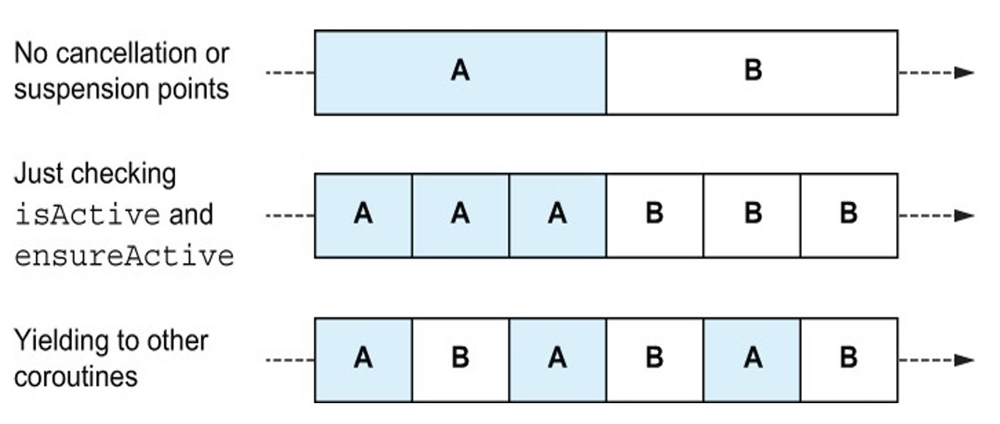

如果没有挂起点，多个协程将始终运行到完成并且（在单线程 dispatcher 上）没有交错。检查 isActive 或调用 ensureActive 允许协程在没有暂停点的情况下，提前在这些取消点取消工作。使用 yield 让其他协程使用底层线程，协程可以交错运行。


15.2.8 Keep cancellation in mind when acquiring resources

使用数据库连接、IO 等资源后需要显式关闭，确保正确释放。由于 Cancellation 和其他异常一样，可能导致代码提前返回。

可以使用 finally 块。

```kotlin
val dbTask = launch {
    val db = DatabaseConnection()
    try {
        delay(500)
        db.write("coroutines")
    } finally {
        db.close()
    }
}
```

如果你在协程中的资源实现了 AutoClosable 接口，可以使用 .use 函数简写。

```kotlin
val dbTask = launch {
    DatabaseConnection().use {
        delay(...)
        it.write(...)
    }
}
```


15.2.9 Frameworks can perform cancellation for you

已了解手动触发协程的取消，或者在 withTimeoutOrNull 的情况下，让协程库决定何时触发取消。实际应用中，framework（例如 Android platform 或网络框架 Ktor）可以提供负责提供协程作用域并触发它们的取消。这些情况下，你的职责是选择正确的协程范围，确保代码可以被取消。

Andorid 应用程序的上下文中，ViewModel 类提供 viewModelScope。当 ViewModel 被清除时，例如当用户离开显示 ViewModel 的界面，viewModelScope 被取消，此 scope 内启动的任何协程也被取消。

```kotlin
class MyViewModel: ViewModel() {
    init {
        viewModelScope.launch {
            while(true) {
                println("Tick")
                delay(1000)
            }
        }
    }
}
```

用 Ktor 编写的服务器端应用程序。这里每个 request handler 都有一个 PipelineContext 类型的对象作为隐式 receiver，该对象继承 CoroutineScope。可以在该 handler 内启动多个协程。当客户端断开连接时，该 coroutine scope 被取消。

对于客户端是否仍然存在都应该异步继续的工作，你需要选择不同的 scope。Ktor 中，Application 类兼作协程作用域，其生命周期与 Ktor 应用程序相同（仅当应用程序停止时才取消）。该 scope 非常适合独立于 request scope 运行的协程，可以通过 call 变量访问它。

```kotlin
routing {
    get("/") {
        call.application.launch {
            println(...)
            delay(5000)
            println("done")
        }
    }
}
```

即使客户端取消 HTTP 请求，启动的协程不会被取消。


### Summary

- 结构化并发使你可以控制协程正在执行的工作，并防止恶意协程逃避取消
- 可以使用挂起 coroutineScope 辅助函数和 CoroutineScope 创建新的协程作用域
  - coroutineScope 专为并发分解工作而设计，启动多个协程，等待计算结果，返回该结果，它是一个挂起函数
  - CoroutineScope 创建一个协程作用域，用于将协程与类的生命周期关联起来，返回对该协程作用域的引用。通常与 SupervisorJob 一起使用
- GlobalScope 不应在程序代码使用，它会破坏结构化并发性
- coroutine context 管理各个协程的执行方式，它沿着协程层次结构继承
- 协程之间的父子层次结构是通过协程上下文中关联的 Job 对象建立的
- suspension point 是协程可以暂停并且其他协程可以开始工作的地方
- cancellation 是通过在 suspension point 抛出 CancellationException 来实现的
- Cancellation 异常不应被吞掉（捕获但不处理），相反，它们要么被重新抛出或者一开始就不被捕获
- 可以使用 cancel 或 withTimeoutOrNull 等函数自行调用取消。现有框架也可以为你取消协程
- 使用 suspend 修饰符不足以支持取消。kt 提供了构建可取消挂起函数的机制，例如 ensureActive 或 yield 、isActive
- framework 使用协程作用域来帮助协程与应用程序的生命周期联系起来（例如 viewModel 在界面显示的时间或执行 request handler 的时间）


## 16 Flows


## 17 Flow operators


## 18 Error handling and testing